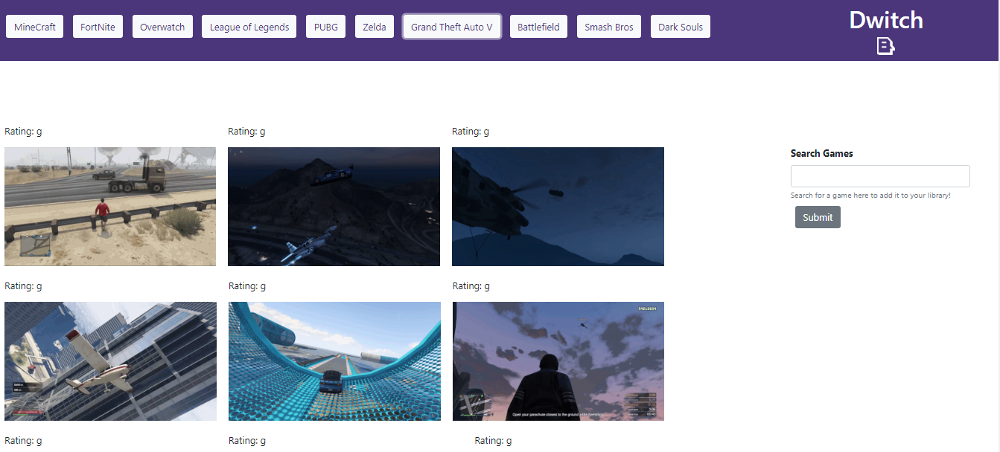

# GifTastic
Working with the Giphy API

# Link to Deployed Site
[Video Game Gif Streaming](https://aehaq.github.io/GifTastic/)

# Images


# Technology Used
- HTML
- CSS (Bootstrap)
- JavaScript (jQuery)
- Ajax
- GIPHY API

# Code Snippets
```
$.ajax({
    url: queryUrl,
    method: "GET"
}).then(function(response) {
    var result = response.data;

    for (let i = 0; i < 10; i++) {
        var gif = result[i];

        var newDiv = $('<div>');
        newDiv.addClass("gif-container");

        newDiv.append('<p>Rating: ' + gif.rating + '</p>')

        var newImg = $('');
        newImg.addClass("gifs")
        newImg.attr("src", gif.images.fixed_height_still.url);
        newImg.attr("stillImg", gif.images.fixed_height_still.url);
        newImg.attr("animImg", gif.images.fixed_height.url);
        newImg.attr("status", "still");

        newDiv.append(newImg);
        $('.gifsHere').append(newDiv);
    }
})
```
Above is a pretty standard ajax call, however, I felt the process of creating the new image tag with jQuery was a noteworthy experience. Of all the attributes added to the image, only the "src" attribute is immediately necessary to display the image. The gifs class as well as the stillimg, animimg and status attributes are all only necessary when factoring in the play/pause funtionality, and remain irrelevant until called upon in the code for that function. So even though the primary reason for the Ajax call is to display images, and the call itself is called upon in the event that displays those images, it is best to grab all the information we need from this single call.


# Learning Points
- Learning how to parse through API Documentation, and translate/append parameters to segments of API searchqueries.
- Communicating with APIs using Ajax, and altering html with information provided by said APIs.
- Dynamically adding and editing the parameters associated with html elements using jQuery.
- Understanding when calling eventlisteners on the document as opposed to an element is necessary.
- Parsing strings from arrays for their use as values.
- Creating, using and referencing non-standard data-attributes to give an element a dynamic state and associated behaviors.

# Author 
Azfar Haq - [GitHub](https://github.com/aehaq)

# License
Standard MIT License